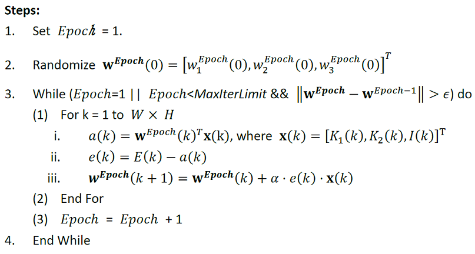
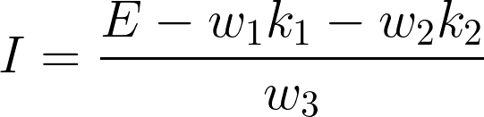
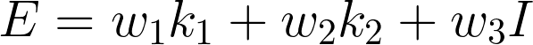
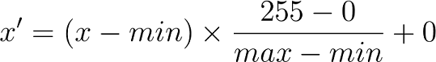
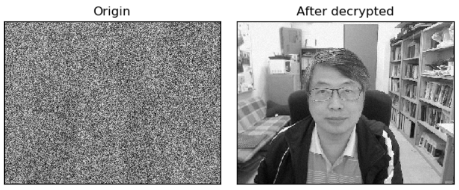
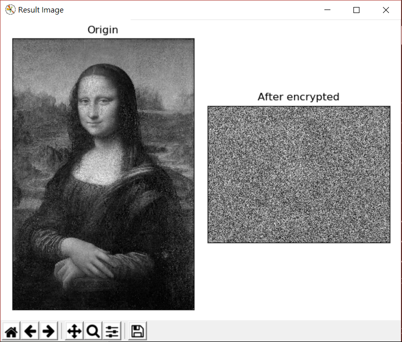
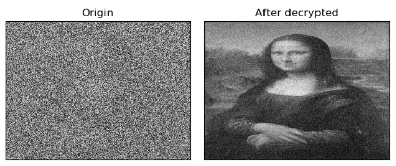

# Image Decryption using Linear Percetpron

## 說明

根據老師所給的圖片資料 (I, E, key1, key2)，透過 Linear Percetpron 找出加密的權重。  
最後能利用該組權重來對圖片進行加密或解碼。

## 環境配置

OS: windows 10  
Python: 3.6.5  
Other packages: matplotlib numpy opencv-python

## 使用說明

Command:
```
gen:    Generate weight vector
        output files: weights.txt, weights.dat

dec:    Decrypt the image(need weights)
        output file: decrypted.png

enc:    Encrypt the image(need weights)
        output file: encrypted.png
```

Usage:
```
python main.py gen
python main.py dec <relative path of image>
python main.py enc <relative path of image>
```

## 檔案

ML_data:

I.png: 原始圖片  
E.png: 加密後的圖片  
key1.png, key2.png: 加密鑰匙  
Eprime.png: 待解碼的圖片  
(以上檔案為老師所提供，皆為 300 x 400)

weights.txt: 所找出的權重  
weights.dat: 所找出的權重(ndarray)
Eprime_dec.png: Eprime 解碼後的圖片

其他在 DEMO 內說明。

## 程式說明

### PLA:  
Perceptron learning algorithm  

利用所給的加密公式和對應的 I, E, key1, key2 去逐步修正 weights。  
只需要一次 epoch 也就是看完一整張圖 (E) 就能收斂。  
最後一輪的更新，前後兩次 weight vector 之間的距離小於 0.1 (𝜖)。  
每次更新以一個 pixel 為單位，每一 epoch 會檢查 WxH 個 pixels。  

Learning rate: 0.00001  



### Decryption

直接對每個 pixel 套用公式取回原像素：



要注意的是算出來的值型別為 float，且範圍會超出 [0, 255]，需再做正規化。

### Encryption

對於圖片大小與加密鑰匙 (300 x 400) 不同的會先調整大小，並以灰階去讀取。  
利用原公式求出加密後的值並正規化即可。



### Normalization

將值對應到 [0, 255]。



### Display

所有結果會由 `matplotlib.pyplot` 的視窗來展示。  
`DEBUG = 1`: 直接使用 `cv2.imshow` 顯示。

## DEMO

`python main.py gen`  

weight vector: [0.249143 0.661382 0.089240]

`python main.py dec ML_data\Eprime.png`  

課程提供之 Eprime 的解碼結果：  

  
檔案：[Eprime_dec.png](ML_data/Eprime_dec.png)

`python main.py enc ML_data\Iprime.jpg`  

其他圖片 Iprime 的加密結果：  

  
檔案：[Iprime_enc.png](ML_data/Iprime_enc.png)

`python main.py dec ML_data\Iprime_enc.png`  

利用 Iprime_enc 再解碼：  

  
檔案：[Iprime_enc_dec.png](ML_data/Iprime_enc_dec.png)

## Reference

[Normalization](https://en.wikipedia.org/wiki/Normalization_(image_processing))

OpenCV:  
[Image display](https://docs.opencv.org/3.0-beta/doc/py_tutorials/py_gui/py_image_display/py_image_display.html)  
[Float image](https://stackoverflow.com/questions/48331211/how-to-use-cv2-imshow-correctly-for-the-float-image-returned-by-cv2-distancet)  
[Doc cv2.imshow](https://docs.opencv.org/3.1.0/d7/dfc/group__highgui.html#ga453d42fe4cb60e5723281a89973ee563)

matplotlib:  
[How to display multiple images in one figure correctly](https://stackoverflow.com/questions/46615554/how-to-display-multiple-images-in-one-figure-correctly) 

所使用之圖片部分取自於課程教材及網路。